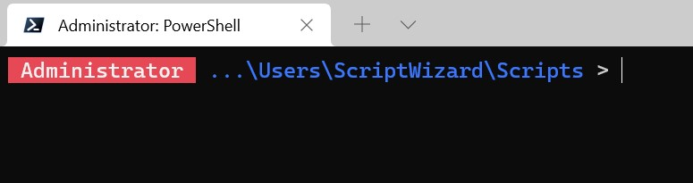

# Minimal PowerShell Prompt

This script alters the default PowerShell prompt to create a more useful experience while trying to remain as minimal as possible.

## Installation

1. Clone this repository to your computer.
2. Add the following line to your PowerShell profile:

    `. C:\path\to\minimal-powershell-profile.ps1`

## Features

### Customized Command Prompt

To keep the command prompt short, only the last 3 segments of the working directory will be printed.

### Show the Runtime of the Previous Command
If the previous command took longer than 5 seconds to run, its runtime will be displayed before the prompt is printed.

### Administrator Warning
When running PowerShell as an Administrator, a very bold warning will be displayed at the beginning of the prompt.

