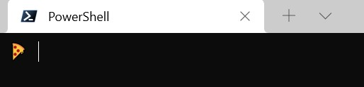
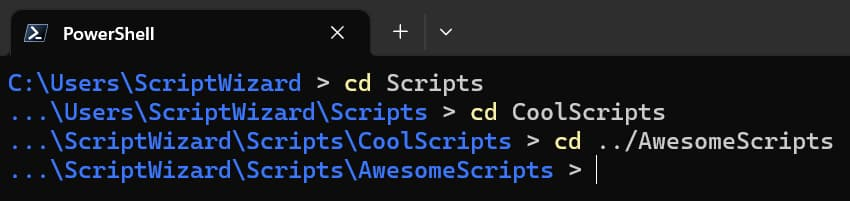
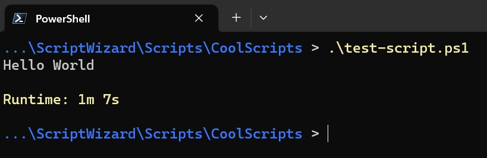

# Minimal PowerShell Prompt

This script alters the default PowerShell prompt to create a more minimal experience.

## Installation

1. Clone this repository to your computer.
2. Add the following line to your PowerShell profile:

    `. C:\path\to\minimal-powershell-profile.ps1`

## Options

Minimal PowerShell Prompt works perfectly without any config. To change any of the default options,
create a `config.json` file in the same directory as `minimal-powershell-prompt.ps1`. Use
`example-config.json` as a guide.

### Customize the Shell Prompt String
The default character used for the shell prompt is ">".
To change it, set the `promptString` property in the config.

```json
{
    "promptString": " 🍕 "
}
```

It can be set to any string.

Open a new PowerShell session to see the change:



### Print the Working Directory
By default, the working directory is not printed at the prompt.
To add it, set the `pathSegmentsToShow` property in the config.

```json
{
    "pathSegmentsToShow": 3
}
```

Setting this property to an integer will display that many segments of the working directory path,
starting from the end. Set the property to "all" to always display the full path.



### Show the Runtime of the Previous Command
By default, the runtime of the previous command will not be shown.
To add it, set the `showRuntimeThreshold` property in the config.

```json
{
    "showRuntimeThreshold": 5
}
```

This property accepts an integer value. It indicates how many seconds a command must run before the runtime
will be displayed. Set it to 0 to see the runtime of all commands, even very short-running ones.


